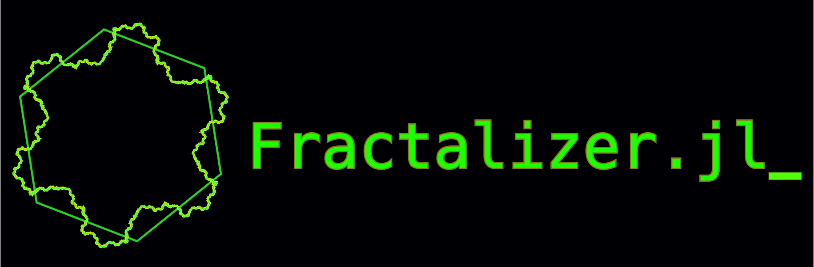

[](https://gabri.xyz/Fractalizer.jl)

Fractalize the edges of any given curve or closed ring using either a template or random noise!

# How to install
Open the REPL and type either 

```using Pkg; Pkg.add(url="Fractalizer")``` 

or 

```] add Fractalizer``` 

Users are encouraged to use environments but it is not necessary. 


# How to use

Here is a basic example to reproduce the fractal in the logo

```julia 
using Fractalizer

template_points = [[0., 0.] 
                   [1.0,1.0] 
                   [3.2, 1.0] 
                   [4.2, -0.5] 
                   [4.5, -0.9] 
                   [7.4, -1.2] 
                   [8,-0.7] 
                   [8.8,0.0] 
                   [9.0, 0.5]
                   [9.6, 0.3]]'

template = Template(template_points)
shape = ClosedShape(makering(0.,0.,1,7))

fractal = fractalize(shape, template, 4)
```

Easy as that!!
For more examples and information please consult the [docs](https://gabri.xyz/Fractalizer.jl).

# Acknowledgements

The algorithm at the base of this code was inspired by the following site: https://line-fractals.vercel.app/

