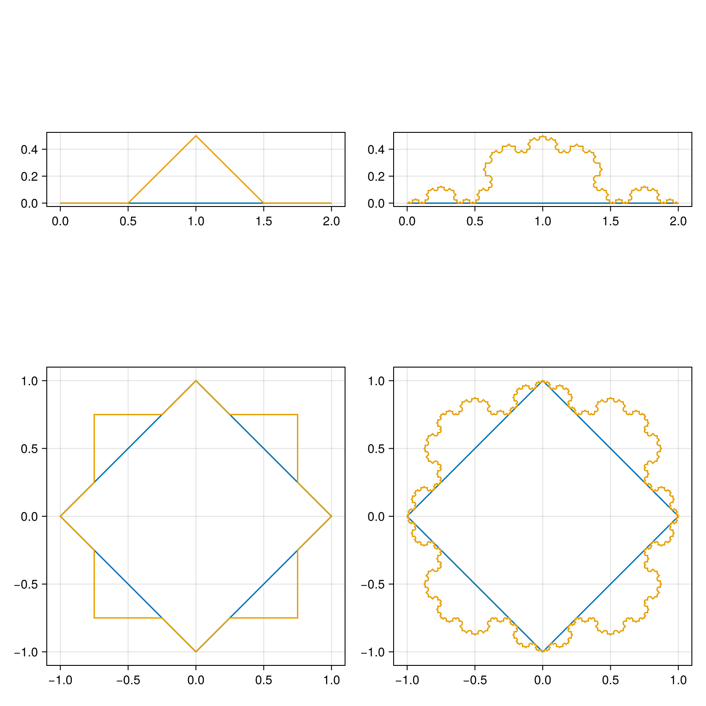
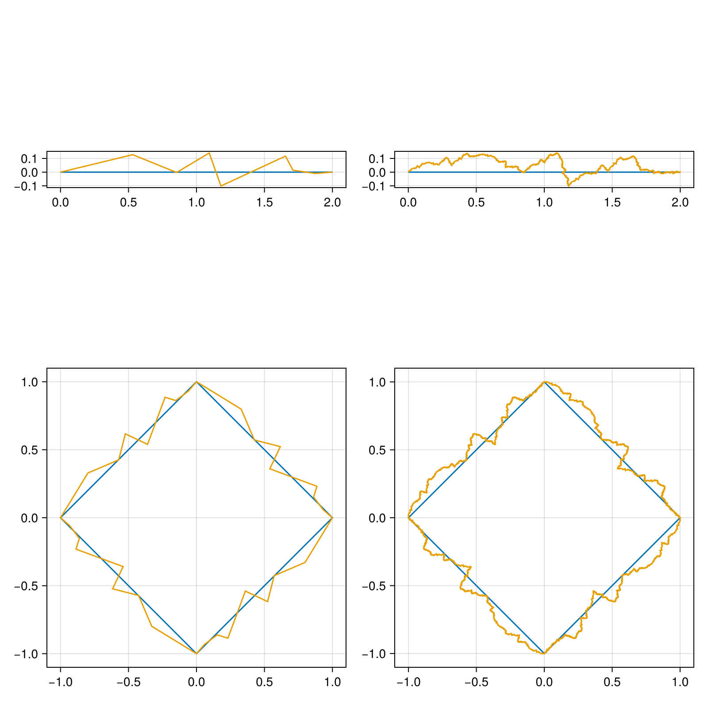
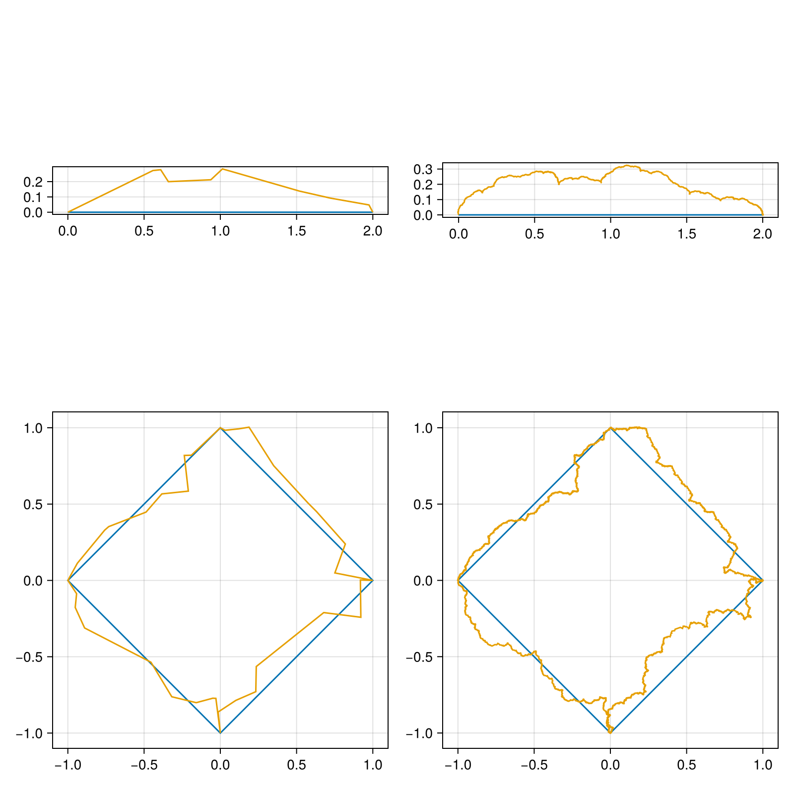

## [1. Custom template](@id examples)

Create a fractalized Shape using a custom template. In this case the shape is also the template.

```@example
using CairoMakie #hide
using Fractalizer


shape_points = [[0., 2.] [0., 0.]]
template_points = [[0., 1., 2., 3., 4.] [0., 0., 1., 0., 0.]]


template = Template(template_points)
shape1 = Shape(shape_points)

shape2 = MakeRing(0.,0.,sqrt(1),5)

fig = Figure(size = (800, 800))

ax = Axis(fig[1,1],  aspect=DataAspect())
ax2 = Axis(fig[1,2], aspect=DataAspect())
ax3 = Axis(fig[2,1], aspect=DataAspect())
ax4 = Axis(fig[2,2], aspect=DataAspect())

lines!(ax,  shape1.xs, shape1.ys)
lines!(ax2, shape1.xs, shape1.ys)

lines!(ax3, shape2.xs, shape2.ys)
lines!(ax4, shape2.xs, shape2.ys)


fractal1 = fractalize(shape1, template)
fractal2 = fractalize(shape1, template, 4)

fractal3 = fractalize(shape2, template)
fractal4 = fractalize(shape2, template, 4)

lines!(ax, fractal1.points)
lines!(ax2, fractal2.points)
lines!(ax3, fractal3.points)
lines!(ax4, fractal4.points)

save("../src/assets/examples/ex1.png", fig); sleep(0.5);nothing #hide
```



## 2. Random template

Create a fractalized Shape using a random template. In this case the same random template will be applied to each segment of the Shape.

```@example
using CairoMakie #hide
using Fractalizer


noise_params = NoiseParams(0.1:0.1, 1.0:1:10.0, -10.0:1:10.0, 100, 4, 10; seeds=[5051219463749335488, 2605820118529195702, 58993957652373096, -3230896108381048720]) # fixed seeds
shape_points = [[0., 2.] [0., 0.]]

template = random_template(noise_params)

shape1 = Shape(shape_points)

shape2 = MakeRing(0.,0.,sqrt(1),5)

fig = Figure(size = (800, 800))
ax = Axis(fig[1,1], aspect=DataAspect())
ax2 = Axis(fig[1,2], aspect=DataAspect())
ax3 = Axis(fig[2,1], aspect=DataAspect())
ax4 = Axis(fig[2,2], aspect=DataAspect())

lines!(ax,  shape1.xs, shape1.ys)
lines!(ax2, shape1.xs, shape1.ys)

lines!(ax3, shape2.xs, shape2.ys)
lines!(ax4, shape2.xs, shape2.ys)


fractal1 = fractalize(shape1, template)
fractal2 = fractalize(shape1, template, 4)

fractal3 = fractalize(shape2, template)
fractal4 = fractalize(shape2, template, 4)

lines!(ax, fractal1.points)
lines!(ax2, fractal2.points)
lines!(ax3, fractal3.points)
lines!(ax4, fractal4.points)

save("../src/assets/examples/ex2.png", fig); sleep(0.5); nothing #hide
```


## 3. No template

Create a fractalized Shape using random templates for each segment

```@example
using CairoMakie #hide
using Fractalizer


noise_params = NoiseParams(0.1:0.1, 1.0:1:10.0, -10.0:1:10.0, 100, 4, 10)
shape_points = [[0., 2.] [0., 0.]]

shape1 = Shape(shape_points)
shape2 = MakeRing(0.,0.,sqrt(1),5)

fig = Figure(size = (800, 800))
ax = Axis(fig[1,1], aspect=DataAspect())
ax2 = Axis(fig[1,2], aspect=DataAspect())
ax3 = Axis(fig[2,1], aspect=DataAspect())
ax4 = Axis(fig[2,2], aspect=DataAspect())

lines!(ax,  shape1.xs, shape1.ys)
lines!(ax2, shape1.xs, shape1.ys)
lines!(ax3, shape2.xs, shape2.ys)
lines!(ax4, shape2.xs, shape2.ys)


fractal1, templates1 = fractalize(shape1, noise_params)

fractal2 = fractalize(shape1, templates1, 4)

fractal3, templates3 = fractalize(shape2, noise_params)
fractal4 = fractalize(shape2, templates3, 4)

lines!(ax, fractal1.points)
lines!(ax2, fractal2.points)
lines!(ax3, fractal3.points)
lines!(ax4, fractal4.points)

save("../src/assets/examples/ex3.png", fig); nothing #hide
```
